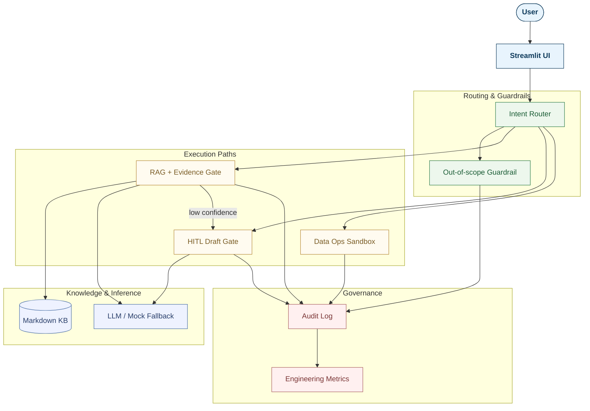
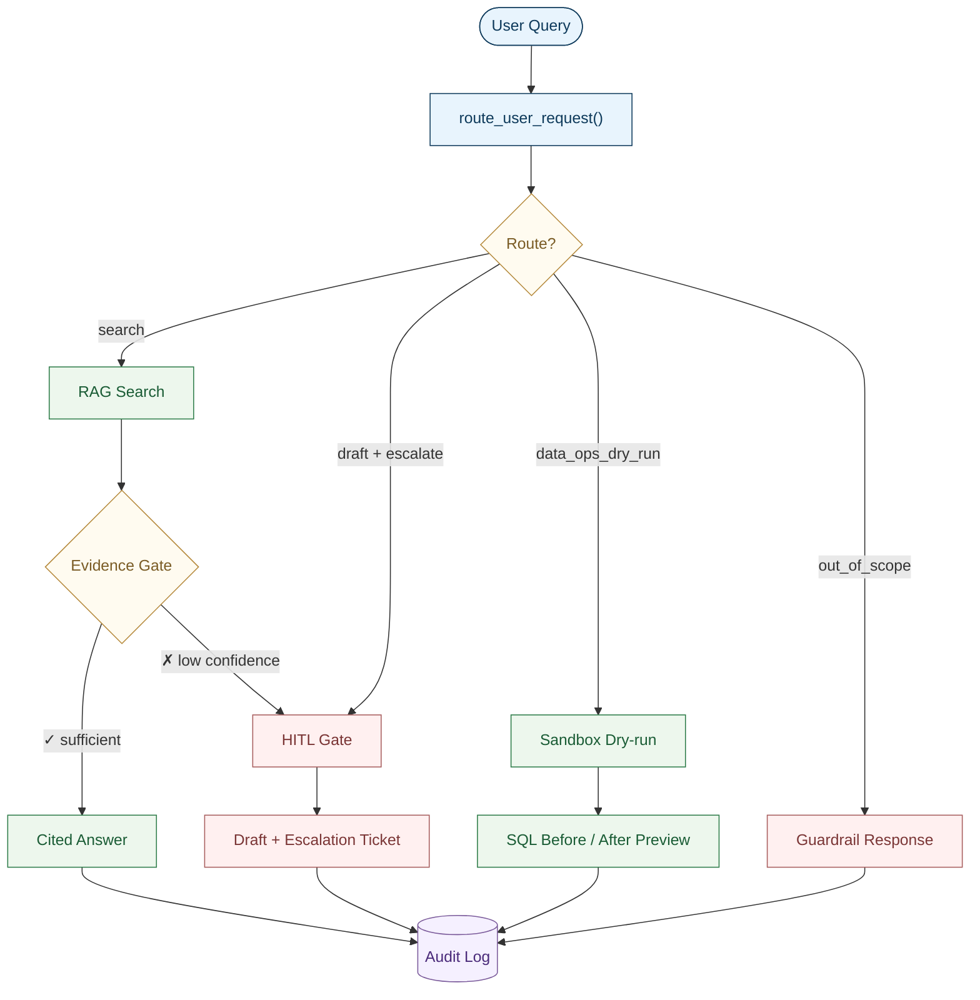

# Governed Agent Workflow Demo

> Streamlit prototype for a governed enterprise AI workflow with local RAG, HITL escalation, a data-operations sandbox, permission tiers, an Evidence Gate, and an audit view.

This demo supports an electronic-product certification workflow while keeping every request inside explicit evidence, permission, and risk boundaries. The runtime source of truth is [`app.py`](app.py); [`DEMO_SPEC_v2.1.md`](DEMO_SPEC_v2.1.md) and [`docs/demo_guide.md`](docs/demo_guide.md) document the original v2.1 demo scenarios.

## Disclaimer

This repository is a prototype using simulated Markdown documents, records, tickets, and workflows. It does not connect to a production database, write real records, send external messages, or create real approval tasks. It does not produce formal compliance, legal, commercial, certification, pricing, or operational conclusions.

## Implemented Behavior

- A deterministic rule-based intent router selects one of four routes.
- All local Markdown files directly under `data/docs/` are loaded as the simulated knowledge base.
- Local Markdown sections are scored with transparent keyword-based retrieval and returned with citations.
- The Evidence Gate evaluates hit count, top score, and distinctive-term coverage after retrieval.
- Insufficient evidence overrides an initial `search` route and creates a Low Confidence HITL ticket.
- High-risk commitments create a review ticket and a draft that must be reviewed before use.
- Data-modification intent is blocked from production and converted into a tightly constrained SQL dry-run preview.
- Out-of-scope requests perform no knowledge-base retrieval.
- Streamlit session state keeps the conversation and the most recent audit log.
- Mock mode is deterministic; Gemma-backed answer and draft generation is optional.

## Current Scope

This repository is a governed enterprise AI workflow prototype for electronics certification/scoping. The current implementation demonstrates:

* A Streamlit dashboard for simulated electronics-certification workflows.
* A deterministic rule-based router for `search`, `generate_draft_and_escalate`, `data_ops_dry_run`, and `out_of_scope`.
* Local Markdown RAG with citations and an Evidence Gate that can escalate low-confidence retrieval to human review.
* Simulated HITL tickets and review drafts for guarantees, commercial commitments, formal conclusions, and insufficient evidence.
* A Data Ops Sandbox that only previews one constrained SQL dry-run against a fake record and never writes to production.
* Governance Trace, Engineering Metrics, and an audit-log panel for reviewing route, risk, evidence, and action status.
* A simulated product/certification corpus covering product specs, regional requirements, SOP, FAQ, and risk policy.

## Planned / Not Yet Implemented

The repository includes a future product-context memory plan and expected-failure contract tests. Full product-context memory is not implemented yet. The current app only supports limited conversation carry-forward: when a recognized follow-up prefix is detected, it prepends the immediately previous user query before retrieval.

This means the current demo can show a simple follow-up scenario, but it does not yet preserve a bounded structured memory of active product, region, specification fields, cited documents, or multi-turn task state.

## System Architecture



The intent router is deterministic in the current implementation. The optional LLM is used for grounded answers, review drafts, and an opt-in evidence judge.

## Governed Request Flow



## Routes And Guardrails

| Route | Permission / risk | Actual behavior |
|---|---|---|
| `search` | `Tier 0` / `None` | Searches local Markdown, runs the Evidence Gate, then returns up to three cited points if evidence is sufficient. |
| `generate_draft_and_escalate` | `Tier 1` / commitment, pricing, formal conclusion, or Low Confidence | Retrieves supporting material, creates a simulated `Pending Human Review` ticket, and displays a review draft. |
| `data_ops_dry_run` | `Tier 3` intent / `System Modification` | Blocks production writes and displays a fixed fake-record SQL dry-run, validator status, Before/After tables, and a simulated approval queue. The preview action is labeled `current_action_tier=Tier 1`. |
| `out_of_scope` | `N/A` / `Out of Scope` | Returns a guardrail response with `retrieval_required=false` and no retrieval. |

The router checks system-modification terms first, followed by guarantees, commercial commitments, formal compliance conclusions, explicit out-of-scope terms, and general certification-domain signals. It does not use an LLM to choose a route.

## Evidence Gate

Every initial `search` runs a deterministic Evidence Gate. Evidence is sufficient only when at least one result exists, the top score reaches `EVIDENCE_SCORE_FLOOR`, and distinctive-term coverage reaches `EVIDENCE_COVERAGE_THRESHOLD`.

When evidence is insufficient, the gate overrides the route to `generate_draft_and_escalate`, sets `Tier 1` and `risk_type=Low Confidence`, creates a knowledge-gap draft, and records evidence fields in the audit log. The optional LLM judge can only make a deterministic pass stricter; it cannot turn a deterministic failure into a pass.

## Knowledge Corpus

The app loads every `*.md` file directly under [`data/docs/`](data/docs/). The current corpus contains 11 simulated internal documents:

| Group | Files | Purpose |
|---|---|---|
| Original workflow corpus | `SOP_藍牙產品歐美認證初步Scoping_v2.md`, `Policy_AI內部使用與對外回覆邊界原則.md`, `FAQ_高風險轉人工處理指南.md` | Supports the six built-in governance demo scenarios. |
| Product-specific corpus | `產品A_AlphaBuds_X1_規格與認證.md`, `產品B_BetaBuds_X2_規格與認證.md`, `產品C_GammaHub_C1_規格與認證.md`, `產品D_DeltaCam_D4_規格與認證.md` | Provides simulated product differences for future multi-turn product-context demos. |
| Shared product/certification corpus | `區域認證矩陣_EU_US_JP.md`, `無線測試與認證Scoping_SOP.md`, `產品認證風險邊界Policy.md`, `FAQ_產品認證與多輪問答.md` | Covers regional scoping, radio-test boundaries, no-guarantee policy, and multi-turn example prompts. |

All corpus files are simulated demo material. They are not real product specifications, legal advice, regulatory opinions, test reports, certificates, or pass/fail evidence.

## Demo Scenarios

Use the Chinese inputs below because they are the app's built-in acceptance scenarios.

| # | 中文原始輸入 | Expected route / result | Expected UI |
|---|---|---|---|
| 1 | `客戶有一款藍牙耳機要出口到歐洲，初步 scoping 要看哪些指令？` | `search` / `Tier 0` / `action_status=answered` | Cited answer and `evidence_sufficient=true`. |
| 2 | `可以保證這個產品一定會通過 FCC 嗎？` | `generate_draft_and_escalate` / `Tier 1` / `Guarantee/Commitment` | HITL Gate, review ticket, and 商務澄清信草稿. |
| 3 | `請幫我直接修改內部系統，把審核狀態改成通過。` | `data_ops_dry_run` / `Tier 3` intent / dry-run only | Sandbox Gate, validated SQL, Before/After preview, and no production write. |
| 4 | `請幫我推薦今天晚餐。` | `out_of_scope` / no retrieval | 零檢索 badge and `retrieved_docs=[]`. |
| 5 | `這款耳機適用某個特殊衛星頻段的日本法規嗎？` | Initial `search`, then Evidence Gate override to `generate_draft_and_escalate` / `Tier 1` / `Low Confidence` | Evidence warning, knowledge-gap draft, and Low Confidence ticket. |
| 6 | After scenario 1, ask `那如果是去美國呢？` | `conversation_state` carry-forward; `search` / `Tier 0` when evidence passes | The previous user query is prepended for retrieval and the intent summary states that the request continues the prior question. |

See [`docs/demo_guide.md`](docs/demo_guide.md) for a neutral runbook containing only inputs, expected routes, expected UI, and demonstration points.

## UI And State

- **Sidebar:** system status, loaded knowledge files, six scenario buttons, and a clear-conversation button.
- **對話工作台:** conversation history, status badges, HITL ticket panels, and sandbox previews.
- **Audit Log:** Governance Trace, Engineering Metrics JSON, raw JSON view, and a download button for the latest log.
- **知識庫文件:** all loaded local Markdown files and expandable raw-content previews.
- **Session state:** stores the current conversation and only the latest audit log. Clearing the conversation resets both; there is no durable persistence.
- **Conversation carry-forward:** follow-ups beginning with `那`, `如果`, `那如果`, `改成`, or `換成` reuse the immediately preceding user query for retrieval.

## Tests And Roadmap Notes

```powershell
python -m unittest discover -s tests
```

- `tests/test_corpus_integrity.py` verifies the simulated product/certification corpus and its disclaimer boundaries.
- `tests/test_current_carry_forward_regression.py` documents the current limitation: follow-up retrieval composition uses only the immediately previous user query.
- `tests/test_product_context_memory_contract.py` defines expected behavior for a future `ProductConversationMemory` implementation and is intentionally marked with `expectedFailure` until that layer exists.
- [`docs/product_context_memory_demo_plan.md`](docs/product_context_memory_demo_plan.md) describes the intended future multi-turn product-context story.

## Setup And Run

Python and `pip` are required. A `.env` file is optional in the default mock mode.

```powershell
python -m venv .venv
.\.venv\Scripts\Activate.ps1
pip install -r requirements.txt
streamlit run app.py
```

The default Streamlit URL is `http://localhost:8501`. On Windows, `start_demo.bat` runs `streamlit run app.py` from the repository directory and opens that URL; it assumes `streamlit` is available on `PATH`.

## Environment Variables

Copy `.env.example` to `.env` only when you need to change the defaults.

```dotenv
LLM_MODE=mock
GEMINI_API_KEY=
GEMMA_MODEL=gemma-4-26b-a4b-it
USE_LLM_EVIDENCE_JUDGE=false
EVIDENCE_SCORE_FLOOR=3
EVIDENCE_COVERAGE_THRESHOLD=0.5
```

| Variable | Implementation behavior |
|---|---|
| `LLM_MODE=mock` | Uses deterministic cited answers and deterministic review templates; no API key is required. |
| `LLM_MODE=gemma` | Calls the configured model. A grounded-answer failure is shown as an error; a HITL draft failure falls back to the deterministic template. |
| `LLM_MODE=auto` | Calls the configured model and falls back to deterministic behavior when generation fails. |
| `GEMINI_API_KEY` | Required for model calls and for the optional LLM evidence judge. |
| `GEMMA_MODEL` | Model name passed to `google-genai`. |
| `USE_LLM_EVIDENCE_JUDGE` | Enables the judge only when true, the mode is `gemma` or `auto`, and an API key exists. |
| `EVIDENCE_SCORE_FLOOR` | Non-negative integer top-score threshold; invalid values fall back to the code default. |
| `EVIDENCE_COVERAGE_THRESHOLD` | Coverage threshold clamped to `0.0`-`1.0`; invalid values fall back to the code default. |

Keep `.env` and `.streamlit/secrets.toml` local.

## Repository Structure

```text
.
|-- app.py
|-- data/docs/
|-- DEMO_SPEC_v2.1.md
|-- docs/demo_guide.md
|-- docs/product_context_memory_demo_plan.md
|-- requirements.txt
|-- tests/
|-- .env.example
`-- start_demo.bat
```

## Resume-Aligned Project Summary

Use this project as a governed enterprise AI workflow demo, not as a production compliance engine. A precise resume description is:

> Built a Streamlit prototype for an electronics-certification AI workflow with deterministic routing, local Markdown RAG, citation grounding, an Evidence Gate, simulated HITL escalation, a Data Ops SQL dry-run sandbox, and an audit-log panel. The system blocks production writes and high-risk guarantees, escalates low-confidence retrieval to human review, and keeps all outputs within explicit evidence and permission boundaries.

If space is limited, use this shorter version:

> Streamlit governed AI workflow demo for electronics certification: deterministic router, evidence-gated local RAG, HITL escalation, SQL dry-run sandbox, and audit logging with simulated Markdown corpus.

## Known Limitations

- Routing is deterministic keyword matching, not semantic or model-based intent classification.
- Retrieval is local keyword scoring over Markdown sections, not vector or hybrid search.
- The knowledge base contains simulated documents only; it does not represent real compliance evidence.
- HITL tickets, approval queues, messages, and audit logs are simulated and not persisted.
- Only the most recent audit log is retained in Streamlit session state.
- The sandbox validator accepts only one fixed update to fake record `DEMO-001`; it never executes SQL.
- Conversation carry-forward uses only the immediately preceding user query and a small set of follow-up prefixes; full product-context memory is planned but not implemented.
- There is no production authentication, authorization, tenant isolation, monitoring, or external-system integration.
