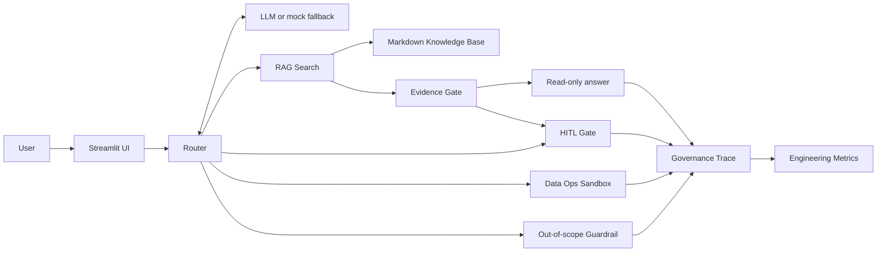
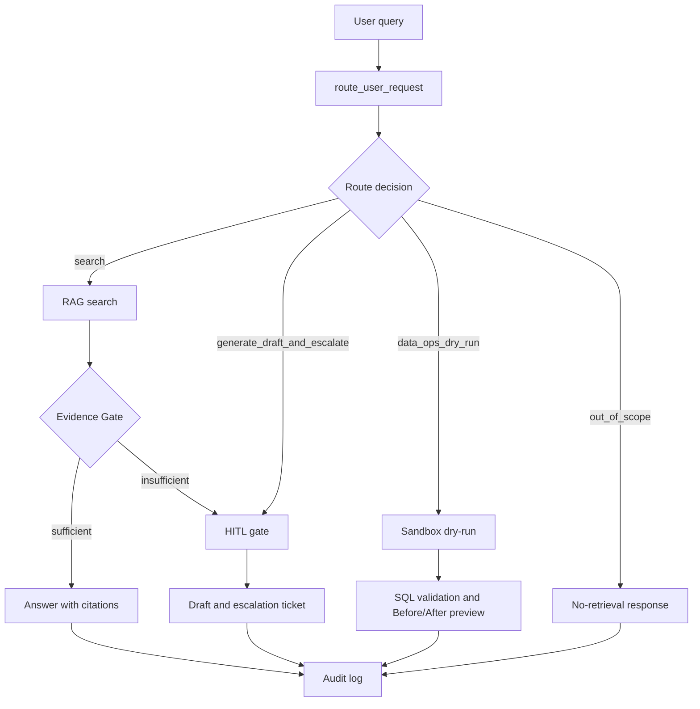
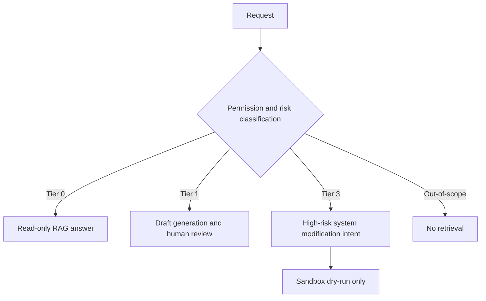

# Governed Agent Workflow Demo

> Prototype for a governed enterprise AI agent workflow with RAG, HITL escalation, sandboxed data operations, permission tiers, and audit logs.

This Streamlit portfolio project demonstrates how an AI agent can support an electronic product certification company while remaining inside explicit evidence, permission, and risk boundaries. The prototype routes requests into read-only knowledge search, human-reviewed drafting, sandboxed data-operation previews, or an out-of-scope guardrail, with a governance trace for every result.

## Disclaimer

This repository is a prototype/demo only. It uses simulated documents and simulated workflows. It does not connect to a production database, send external messages, or produce formal compliance conclusions. Outputs must not be treated as certification, legal, commercial, or operational commitments.

## What This Demo Shows

- Local Markdown RAG search with source citations
- Structured request routing through `route_user_request`
- An Evidence Gate that can escalate low-confidence retrieval
- Human-in-the-loop review for high-risk commitments
- A Data Ops Sandbox with SQL dry-run validation and Before/After preview
- Permission tiers and risk-aware routing
- Governance Trace and Engineering Metrics audit logs
- Deterministic mock mode, with an optional Gemini/Gemma-backed mode

## System Architecture



## Data Flow



## Permission / Risk Flow



## Core Routes

| Route | Typical intent | Demo behavior |
|---|---|---|
| `search` | Certification scoping or SOP questions | Tier 0 RAG answer with citations, subject to the Evidence Gate |
| `generate_draft_and_escalate` | Guarantees, pricing, external commitments, formal conclusions, or low confidence | Tier 1 safe draft and HITL ticket |
| `data_ops_dry_run` | Internal system modification intent | Tier 3 intent is blocked from production and shown as a validated dry-run preview |
| `out_of_scope` | Unrelated requests | Guardrail response with no knowledge-base retrieval |

## Evidence Gate

Retrieved evidence is not automatically sufficient evidence. After a `search` route retrieves documents, the Evidence Gate evaluates signals such as hit count, top score, coverage, and missing terms. If the evidence does not adequately support the request, the workflow escalates to a low-confidence HITL path instead of presenting a confident answer. The deterministic gate remains the default; an optional LLM evidence judge is feature-flagged.

## Demo Scenarios

1. Ask a supported Bluetooth certification scoping question to see a Tier 0 cited answer.
2. Ask a niche question unsupported by the simulated knowledge base to trigger low-confidence escalation.
3. Ask for a guaranteed certification outcome or formal quote to create a Tier 1 review ticket and safe draft.
4. Ask to modify an internal case record to see a Tier 3 SQL dry-run and Before/After preview.
5. Ask an unrelated question to confirm the out-of-scope route performs no retrieval.

More presenter guidance is available in [`DEMO_SCRIPT.md`](DEMO_SCRIPT.md).

## Setup and Run

Requirements: Python 3.10 or newer.

```bash
python -m venv .venv
# Windows PowerShell:
.\.venv\Scripts\Activate.ps1
pip install -r requirements.txt
streamlit run app.py
```

The app opens at `http://localhost:8501`. Windows users can also run `start_demo.bat`.

## Environment Variables

Copy `.env.example` to `.env` and keep `.env` local. Placeholder configuration:

```dotenv
LLM_MODE=mock
GEMINI_API_KEY=
GEMMA_MODEL=gemma-4-26b-a4b-it
USE_LLM_EVIDENCE_JUDGE=false
EVIDENCE_SCORE_FLOOR=3
EVIDENCE_COVERAGE_THRESHOLD=0.5
```

- `LLM_MODE=mock` runs the deterministic portfolio demo without an API key.
- `LLM_MODE=gemma` uses the configured model and requires `GEMINI_API_KEY`.
- `LLM_MODE=auto` attempts the configured model and falls back to deterministic behavior.
- Never commit `.env` or `.streamlit/secrets.toml`.

## Repository Structure

```text
.
|-- app.py                 # Streamlit UI, routing, gates, sandbox, and logs
|-- data/docs/             # Simulated Markdown knowledge base
|-- DEMO_SCRIPT.md         # Presenter scenarios and talking points
|-- DEMO_SPEC.md           # Earlier prototype specification
|-- DEMO_SPEC_v2.1.md      # Current detailed demo specification
|-- requirements.txt
|-- .env.example
`-- start_demo.bat
```

## Limitations / Intentionally Not Implemented

- No production database connection or write path
- No external email, messaging, ticketing, or approval-system integration
- No formal compliance, legal, pricing, or certification conclusions
- Small simulated Markdown knowledge base
- Simplified retrieval scoring and demo-calibrated evidence thresholds
- Fake sandbox records and previews only
- No production authentication, authorization, or tenant isolation

## Suggested Production Extensions

- Add identity-aware access control and document-level permissions
- Use a production retrieval layer with evaluation datasets and calibrated thresholds
- Integrate durable HITL approval queues and ticketing systems
- Add policy versioning, immutable audit storage, monitoring, and alerts
- Introduce secure, separately authorized execution services after approval
- Add automated red-team, regression, and evidence-quality evaluations
